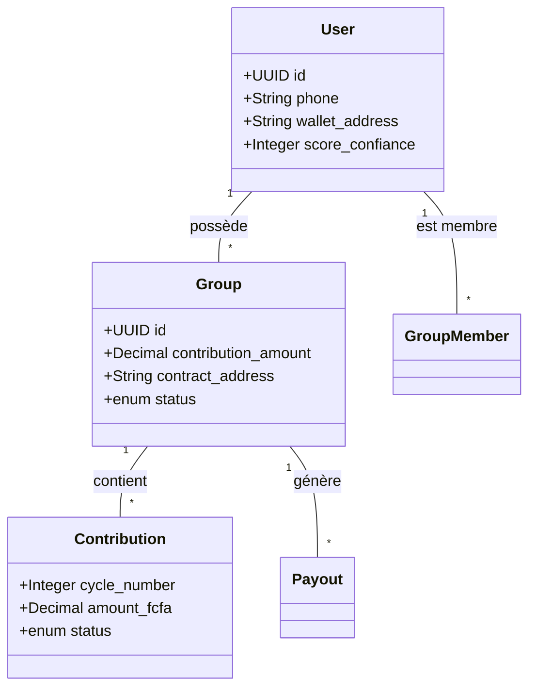
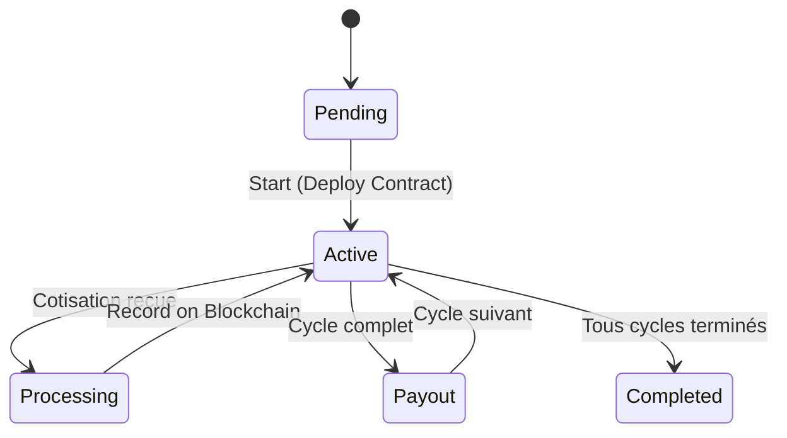

# 🔗 TontineChain Backend - Laravel Edition
**Inclusion Financière & DeFi au Bénin | Hackathon MIABE 2026 - Domaine D02**


TontineChain est une plateforme blockchain de gestion de tontines rotatives automatisée. Ce backend Laravel orchestre les interactions entre les utilisateurs, le réseau Polygon PoS, et les services de paiement Mobile Money (FedaPay).

---

## 🚀 Stack Technique
- **Framework** : Laravel 12 (PHP 8.2+)
- **Base de données** : PostgreSQL / SQLite
- **Blockchain** : Solidity (Smart Contracts), Polygon PoS (Gasless EIP-2771)
- **Paiements** : FedaPay (MTN / Moov Money)
- **Notifications** : SMS (Infobip), In-App
- **API Docs** : [Swagger UI](http://localhost:8000/api/documentation)
- **Tests** : PHPUnit / Pest

---

## 📊 Architecture & UML

### 1. Diagramme de Cas d'Utilisation
```mermaid
useCaseDiagram
    actor Member as "Membre"
    actor Creator as "Créateur"
    actor FedaPay as "FedaPay API"
    actor Poly as "Polygon Network"

    package "TontineChain" {
        usecase UC1 as "Authentification OTP"
        usecase UC2 as "Créer Tontine"
        usecase UC3 as "Inviter/Rejoindre"
        usecase UC4 as "Cotiser (MoMo)"
        usecase UC5 as "Libérer Cagnotte"
    }

    Member --> UC1
    Member --> UC3
    Member --> UC4
    Creator --> UC2
    UC4 --> FedaPay
    UC4 --> Poly
    UC5 --> Poly
```

### 2. Modèle de Données (Class Diagram)


### 3. Cycle de Vie (State Diagram)


---

## 🛠️ Installation & Setup

1. **Clonage & Dépendances** :
   ```bash
   composer install
   ```

2. **Configuration** :
   Copiez le fichier `.env.example` vers `.env` et configurez vos clés :
   ```bash
   cp .env.example .env
   php artisan key:generate
   ```

3. **Base de données** :
   ```bash
   php artisan migrate
   ```

4. **Lancement** :
   ```bash
   php artisan serve
   ```

5. **Tests** :
   ```bash
   php artisan test
   ```

---

## 🤖 Fonctionnalités Intelligentes
- **Score de Confiance** : Calculé automatiquement en fonction de la ponctualité des paiements.
- **Relayeur Gasless** : Les utilisateurs ne paient pas de frais de gaz sur Polygon.
- **Automatisation** : Des jobs planifiés gèrent les rappels et les sanctions chaque matin.

---

## 📄 Licence
Hackathon MIABE 2026 - Domaine D02.
Made with ❤️ by Antigravity AI.
